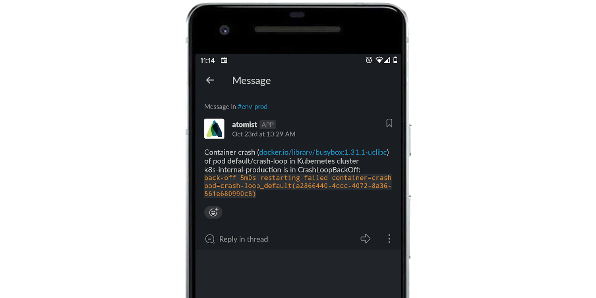

Kubernetes is great, sometimes too great. We have come to rely on Kubernetes
monitoring and fixing the resources we run on it, restarting failed containers
and autoscaling clusters to accommodate increasing workloads, and therefore we
rarely check to make sure everything is running smoothly. This skill takes the
burden off you and your team to periodically check the health of your
applications or manually verify that a new deployment was successful.

> When a pod is unhealthy in a Kubernetes cluster, does anyone notice? Have you
> ever deployed a new version of an app to Kubernetes, tried to test the new
> feature you added or bug you fixed and found the same behavior as before? Have
> you ever then double-checked your code, rerun your tests, checked a few more
> things, only then to realize that while the deployment got updated, the new
> pods never replaced the old because of some misconfiguration or other mistake?
> If so, this skill is for you.

Leveraging the [Atomist Kubernetes integration][k8s-integration], this skill
sends chat alerts when pods in your Kubernetes clusters are not healthy. Various
sorts of unhealthiness are detected:

-   A pod container is in image pull back-off.
-   A pod container is in crash loop back-off.
-   A pod container is OOMKilled, i.e., killed because it has used too much
    memory.
-   A pod init container has failed too many times.
-   A pod container restarts too many times.
-   A pod container is not in a ready state.
-   A pod has not been scheduled, e.g., when the cluster nodes do not have
    enough CPU or memory.
-   A pod is misconfigured, e.g., it references a secret that does not exist.

This skill will alert you at most once per day per unique pod/container. This
skill will _not_ alert on pods/containers in [namespaces][] that start with
`kube-`.

Let this skill take care of monitoring your Kubernetes resources so you can
focus on developing and improving them.

[k8s-integration]:
    https://go.atomist.com/catalog/integration/kubernetes
    "Kubernetes Integration"
[namespaces]:
    https://kubernetes.io/docs/concepts/overview/working-with-objects/namespaces/
    "Kubernetes namespaces"

### Alert when a pod is unschedulable

### Alert when a container is crash looping

### Report when a troubled pod recovers or is deleted

