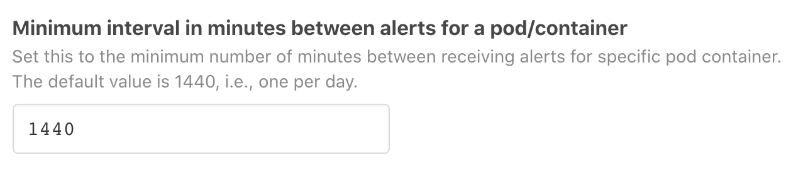
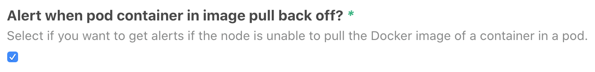
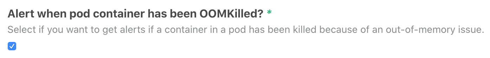
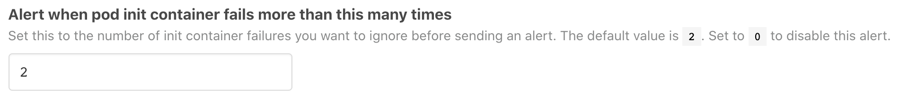
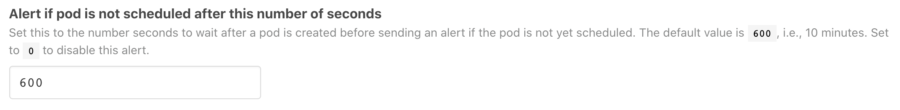
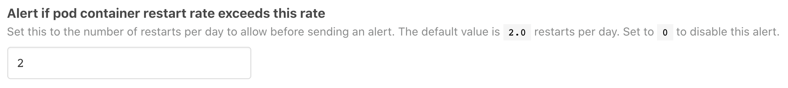
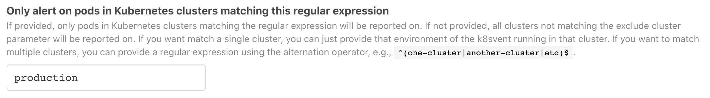
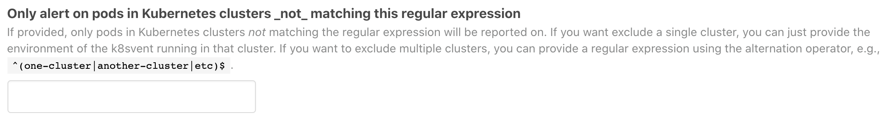
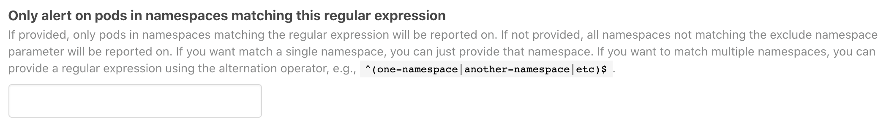
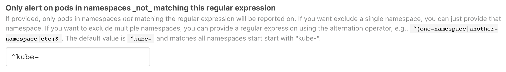

# `atomist/kubernetes-pod-health-skill`

Report when pods in a Kubernetes cluster are not healthy.

<!---atomist-skill-readme:start--->

[Code](https://github.com/atomist-skills/kubernetes-pod-health-skill) - [Issues](https://github.com/atomist-skills/kubernetes-pod-health-skill/issues)

## What it's useful for

This skill will post Slack messages when pods in your Kubernetes
cluster(s) are not healthy.

Kubernetes is great, sometimes too great.  We have come to rely on
Kubernetes monitoring and fixing the resources we run on it,
restarting failed containers and autoscaling clusters to accommodate
increasing workloads, and therefore rarely check to make sure
everything is running smoothly.  This skill takes the burden off you
and your team to periodically check the health of your applications or
manually verify that a new deployment was successful.

Let this skill take care of monitoring your Kubernetes resources so
you can focus on developing and improving them.

## Before you get started

Connect and configure these integrations:

1.  **Kubernetes**
2.  **Slack**

Both the **Kubernetes** and **Slack** integrations must be configured
to used this skill.  This skill will send a notification message to
the configured Slack channel(s) when a Kubernetes pod is unhealthy.

## How to configure

1.  **Enter a unique name for this configuration**

    If this is the first time you are configuring this skill, you can
    accept the default configuration name, "Kubernetes Pod Health
    Monitor".  If you are creating a second configuration, e.g., so
    you can send alerts from different namespaces and/or clusters to
    different chat channels, enter a name that is unique among all
    configurations for this skill.

    

2.  **Enter the chat channel(s) to send alerts to**

    The only required configuration parameter is the name of the chat
    channel(s) you want to send the Kubernetes pod health alerts to.
    You must enter one or more channel names.  Alerts will be sent to
    all chat channels entered.  To enter more than one channel, click
    the "Add" button so additional text boxes will appear.

    

3.  **Review remaining configuration**

    We recommend you accept the default values for all remaining
    configuration values.

    Here is a brief run-through of the available options.

    -   _Minimum interval in minutes between alerts for a pod/container_

        Set this to the minimum number of minutes between receiving
        new alerts for a specific pod container.  Within the interval,
        alerts for a given pod container will overwrite the original
        message.  The default value, `1440`, sets the interval such
        that at most one alert message is created per pod container
        per day.

        

        > Note: New alerts reset the start of the interval, so if you
        > have it set for one message per day and a new alert is
        > triggered every 23 hours, no new message will ever be
        > written.

    -   _Alert when pod container in crash loop back off?_

        Select if you want to get alerts if a container in a pod is
        repeatedly crashing.

        

    -   _Alert when pod container in image pull back off?_

        Select if you want to get alerts if the node is unable to pull
        the Docker image of a container in a pod.

        

    -   _Alert when pod container has been OOMKilled?_

        Select if you want to get alerts if a container in a pod has
        been killed because of an out-of-memory issue.

        

    -   _Alert when pod init container fails more than this many times_

        Set this to the number of init container failures you want to
        ignore before sending an alert.  The default value is `2`.
        Set to `0` to disable this alert.

        

    -   _Alert if pod container restarts exceeds this value_

        Set this to the maximum number of pod container restarts to
        allow before sending an alert.  The default value is `10`
        restarts.  Set to `0` to disable this alert.

        

    -   _Alert if pod container is not ready after this number of seconds_

        Set this to the number seconds to wait after a running
        container starts before before sending an alert if the
        container is not yet ready.  The default value is `600`, i.e.,
        10 minutes.  Set to `0` to disable this alert.

        

    -   _Alert if pod is not scheduled after this number of seconds_

        Set this to the number seconds to wait after a pod is created
        before sending an alert if the pod is not yet scheduled.  The
        default value is `600`, i.e., 10 minutes.  Set to `0` to
        disable this alert.

        

    -   _Alert if pod container restart rate exceeds this rate_

        Set this to the number of restarts per day to allow before
        sending an alert.  The default value is `2.0` restarts per
        day.  Set to `0` to disable this alert.

        

    -   _Kubernetes cluster selection_

        If you have configured more than one Kubernetes cluster
        providers, you may wish to send alerts from different clusters
        to different chat channels.  You can select and exclude
        Kubernetes clusters using the cluster include and exclude
        [regular expression][regexp] parameters.  The regular
        expressions are matched against the names you provided for
        your Kubernetes cluster providers.

        If you want match a single cluster, you can just provide the
        name of that Kubernetes cluster integration as the regular
        expression.  If you want to match multiple Kubernetes cluster
        providers, you can use the regular expression alternation
        operator (`|`), e.g., `one-cluster|another-cluster|etc`.

        The table below describes how the Kubernetes cluster provider
        name matching is performed for the possible combinations of
        providing and omitting these parameters.

        Include | Exclude | Description
        --------|---------|------------
        Provided | Provided | Must match include and not match exclude
        Provided | Omitted | Must match include
        Omitted | Provided | Must not match exclude
        Omitted | Omitted | All considered matching

        
        

    -   _Kubernetes namespace selection_

        If you only want to report on certain [namespaces][namespace]
        in your Kubernetes clusters, you can select and exclude
        namespaces across all configured clusters (see _Kubernetes
        cluster selection_ above) using the namespace include and
        exclude [regular expression][regexp] parameters.  The regular
        expressions are matched against all namespaces in all
        Kubernetes clusters configured using the cluster include and
        exclude parameters.

        The default value for the "namespace exclude" regular
        expression parameter is `^kube-`, which causes pods in all
        namespaces starting with "kube-" to be excluded from
        reporting.  To include namespaces starting with "kube-" in
        alerts, you must specify an alternative regular expression.
        For example, to receive alerts for pods in all namespaces,
        enter a "namespace exclude" regular expression that matches no
        namespaces, e.g., `A` will not match any namespace since
        Kubernetes namespaces can only use lower-case letters,
        numbers, and dash (`-`) characters.

        If you want match a single namespace, you can just provide
        that namespace as the regular expression.  If you want to
        match multiple namespaces, you can use the regular expression
        alternation operator (`|`), e.g.,
        `one-namespace|another-namespace|etc`.

        The table below describes how the Kubernetes namespace
        matching is performed for the possible combinations of
        providing and omitting these parameters.

        Include | Exclude | Description
        --------|---------|------------
        Provided | Provided | Must match include and not match exclude
        Provided | Omitted | Must match include and not start with "kube-"
        Omitted | Provided | Must not match exclude
        Omitted | Omitted | Must not start with "kube-"

        
        

4.  **Submit the skill configuration**

    Click the "Submit" button to save your configuration and activate
    the skill.

    

[regexp]: https://www.regular-expressions.info/ (Regular Expressions)
[namespace]: https://kubernetes.io/docs/concepts/overview/working-with-objects/namespaces/

- [Walk user through configuration page, explaining parameters, selection and input options, and corresponding outcomes to expect.]
- [Utilize numbered list to separate steps in configuration process, correlating to config page parameters.]
- [Utilize screenshots to give precise context around parameters and parameter options.]
- [Utilize bulleted lists to create succinct explanation of options available.]
- [Utilize callouts for extra tips/tricks. These can break up the page so it's not so monotonous. These shouldn't be essential pieces of information, they should be seen as extra.]

## How to use it

1.  **Configure the skill**

    Provide the name of at least one chat channel where you want the
    pod health alerts to go.  See the above section for more details
    on how to configure the skill and the meaning of various
    configuration parameters.

2.  **Stop worrying**

    No longer waste time going to a dashboard or running `kubectl`
    commands to check on the health of pods in your Kubernetes
    clusters.  Stop worrying about the health of pods in your
    Kubernetes clusters, knowing you only need to take action when you
    see a chat message!  _Viva la ChatOps!_

<!---atomist-skill-readme:end--->

---

Created by [Atomist][atomist].
Need Help?  [Join our Slack workspace][slack].

[atomist]: https://atomist.com/ (Atomist - Automate All the Software Things)
[slack]: https://join.atomist.com/ (Atomist Community Slack) 
