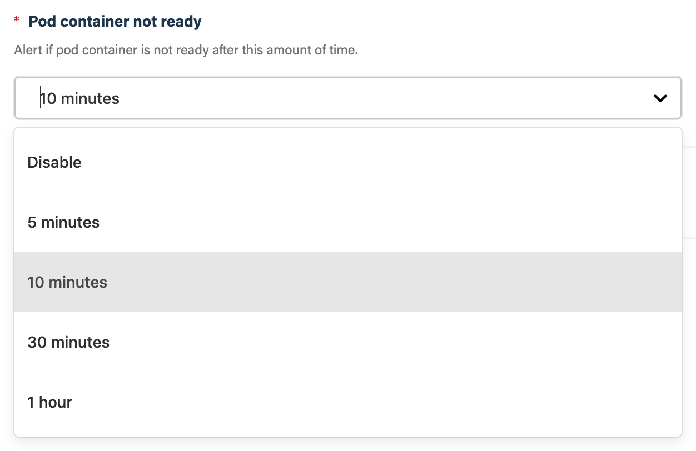

# `atomist/kubernetes-pod-health-skill`

<!---atomist-skill-description:start--->

Report when pods in a Kubernetes cluster are not healthy

<!---atomist-skill-description:end--->

<!---atomist-skill-long_description:start--->

In coordination with the k8svent utility, report when containers in
pods in Kubernetes clusters are not healthy.

<!---atomist-skill-long_description:end--->

<!---atomist-skill-readme:start--->

[Code](https://github.com/atomist-skills/kubernetes-pod-health-skill) - [Issues](https://github.com/atomist-skills/kubernetes-pod-health-skill/issues)

## What it's useful for

This skill will post Slack messages when pods in your Kubernetes
cluster(s) are not healthy.

Kubernetes is great, sometimes too great.  We have come to rely on
Kubernetes monitoring and fixing the resources we run on it,
restarting failed containers and autoscaling clusters to accommodate
increasing workloads, and therefore rarely check to make sure
everything is running smoothly.  This skill takes the burden off you
and your team to periodically check the health of your applications or
manually verify that a new deployment was successful.

This skill, in coordination with the Atomist Kubernetes provider
integration, monitors the activity of pods in your cluster and
notifies you when:

-   A pod container is in image pull back-off.
-   A pod container is in crash loop back-off.
-   A pod container is OOMKilled, i.e., killed because it has used too much memory.
-   A pod init container has failed too many times.
-   A pod container restarts too many times.
-   A pod container is not in a ready state.
-   A pod has not been scheduled, e.g., when the cluster nodes do not have enough CPU or memory.
-   A pod is misconfigured, e.g., it references a secret that does not exist.

This skill will alert you at most once per day per unique
pod/container.  This skill will _not_ alert on pods/containers in
[namespaces][] that start with `kube-`.

Let this skill take care of monitoring your Kubernetes resources so
you can focus on developing and improving them.

[namespaces]: https://kubernetes.io/docs/concepts/overview/working-with-objects/namespaces/

## Before you get started

Connect and configure these integrations:

1.  **Kubernetes**
2.  **Slack**

Both the **Kubernetes** and **Slack** integrations must be configured
to enable this skill.  This skill will send a notification message to
the configured Slack channel(s) when a Kubernetes pod is unhealthy.

## How to configure

1.  **Enter a unique name for this configuration**

    If this is the first time you are configuring this skill, you can
    accept the default configuration name, "Kubernetes Pod Health
    Monitor".  If you are creating a second configuration, e.g., so
    you can select different Kubernetes clusters, chat channels,
    and/or configuration values, enter a name that is unique among all
    configurations for this skill.

    

2.  **Ensure required integrations are available**

    If all of the integrations do not display a green check mark,
    click on the integration(s) that do not have the green check mark
    to configure/add the required integration.

    

2.  **Select the Kubernetes cluster(s) to alert on**

    Select the Kubernetes cluster(s) you want to receive alerts for.
    You must select one or more clusters.  You can select clusters one
    at a time.  You can deselect individual clusters by clicking the
    "X" to the right of their name.  You can deselect all clusters by
    click the gray "X" at the top-right of the drop down.

    

2.  **Select the chat channel(s) to send alerts to**

    Select the chat channel(s) you want to send the Kubernetes pod
    health alerts to.  You must select one or more channel names.
    Alerts will be sent to all chat channels entered.  You can select
    channels one at a time.  You can deselect channels by clicking the
    "X" to the right of their name.  You can deselect all channels by
    click the gray "X" at the top-right of the drop down.

    

3.  **Review remaining configuration**

    We recommend you accept the default values for all remaining
    configuration values.

    Here is a brief run-through of the available options.

    -   _Pod container restarts_

        Alert if the count of pod container restarts reaches this
        value or higher.

        

    -   _Pod container not ready_

        Alert if pod container is not ready after amount of time
        selected.

        

4.  **Submit the skill configuration**

    Click the "Submit" button to save your configuration and activate
    the skill.

    

## How to use it

1.  **Configure the skill**

    Select at least one Kubernetes and chat channel and click the
    "Submit" button.  See the above section for more details on how to
    configure the skill and the meaning of various configuration
    parameters.

2.  **Stop worrying**

    No longer waste time going to a dashboard or running `kubectl`
    commands to check on the health of pods in your Kubernetes
    clusters.  Stop worrying about the health of pods in your
    Kubernetes clusters, knowing you only need to take action when you
    see a chat message!  _Vive la ChatOps!_

<!---atomist-skill-readme:end--->

---

Created by [Atomist][atomist].
Need Help?  [Join our Slack workspace][slack].

[atomist]: https://atomist.com/ (Atomist - Automate All the Software Things)
[slack]: https://join.atomist.com/ (Atomist Community Slack) 
