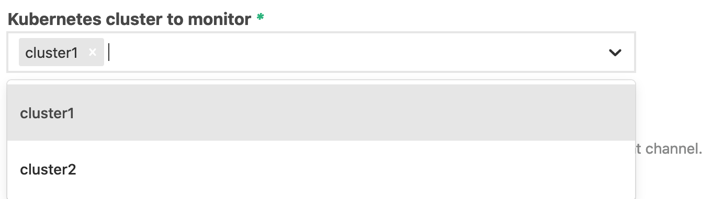
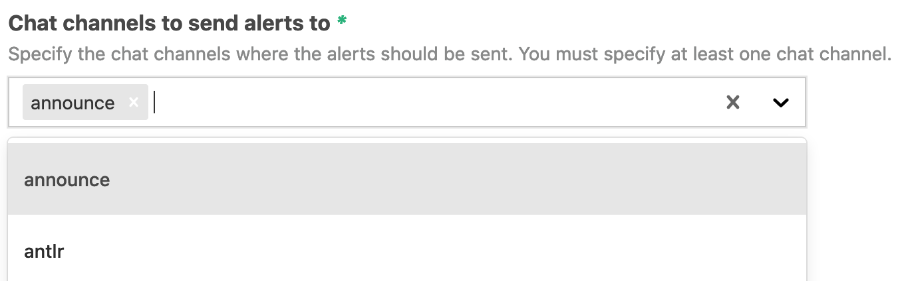
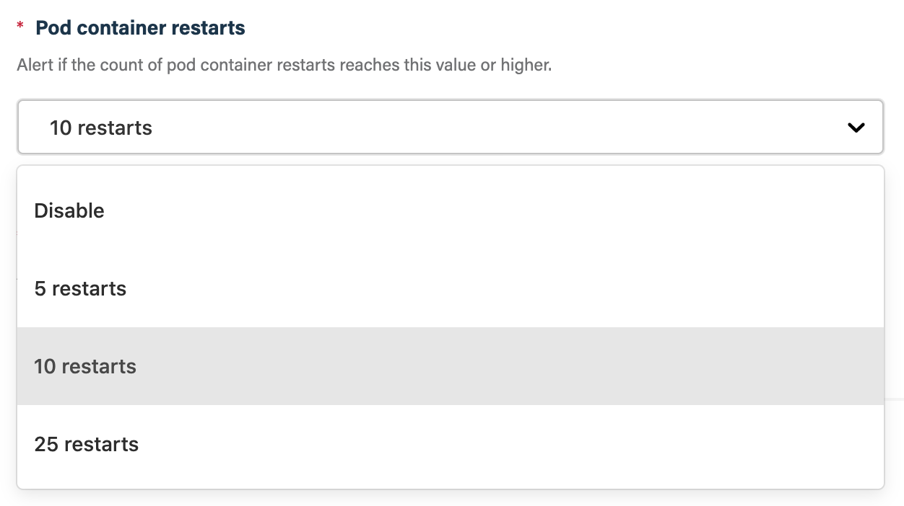

## Before you get started

Connect and configure these integrations:

1.  [**Kubernetes**](https://go.atomist.com/catalog/integration/kubernetes "GitHub Integration")
    _(required)_
2.  [**Slack**](https://go.atomist.com/catalog/integration/slack "Slack Integration")
    or
    [**Microsoft Teams**](https://go.atomist.com/catalog/integration/microsoft-teams "Microsoft Teams Integration")
    _(required)_

## How to configure

1.  **Select the Kubernetes cluster(s) to alert on**

    

    Select the Kubernetes cluster(s) you want to receive alerts for. You must
    select one or more clusters. You can select clusters one at a time. You can
    deselect individual clusters by clicking the "X" to the right of their name.
    You can deselect all clusters by click the gray "X" at the top-right of the
    drop down.

1.  **Select the chat channel(s) to send alerts to**

    

    Select the chat channel(s) you want to send the Kubernetes pod health alerts
    to. You must select one or more channel names. Alerts will be sent to all
    chat channels entered. You can select channels one at a time. You can
    deselect channels by clicking the "X" to the right of their name. You can
    deselect all channels by click the gray "X" at the top-right of the drop
    down.

1.  **Pod container restarts**

    

    Alert if the count of pod container restarts reaches or exceeds this value.

1.  **Pod container not ready**

    

    Alert if pod container is not ready after the amount of time selected.

1.  **Activate the skill**

    Save your configuration and activate the skill by clicking the "Enable
    skill" button.
